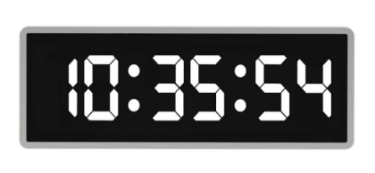

# Digital Clock

## Requirements
Create a widget that renders the current time in HH:MM:SS format using a 7-segment digital display. You are free to choose to use 12-hour or a 24-hour display.

Here's an example of a digital clock, but you can exercise your creativity by choosing different colors and styling it differently. It should however still function as a clock.

## Implementation
We can separate out the solution into two parts, the update loop and the rendering.

## Update loop
We need a timer to refresh the page and render the current time every second. To create the timer, we can use a setInterval and kick off the update loop when the clock is initialized.

The beforeunload event is fired when the tab/window is about to be closed. As a good practice it will be good to clear all active intervals before the tab/window closes because in some old browsers, not doing that could result in memory leaks. In most browsers these days, it's not that important to do so.

This part is exactly the same as the Analog Clock question.

## Rendering
Now that we have logic that is invoked at fixed intervals, we can write the logic to render the current date. First create two functions to render the digit and separator.

  * digit: renders numbers from 0-9 using the segment display. We make use of two square 
s and CSS borders to achieve the effect. For each number, create a configuration of the borders that need to be shown and retrieve the configuration for that number.
  * separator: renders the two circles that look like colons.

To get the first digit of an hour/minute/second, we can divide by 10 and round it down. To get the second digit, we do modulo 10 to leave only the value in the ones-place.

## Test Cases
  * See that the clock updates every second.
  * Observe the clock for at least 10 seconds to see that each digit is displayed correctly.

## Notes
The update frequency of the timer depends on how accurate we want the clock to be. The maximum we can set is 1000ms, however, the clock's accuracy might be off by 1000ms in the case we load the page on the last millisecond of the second. However, using too small of an interval can be quite expensive. Hence a middleground we've chosen is 100ms. The clock can only ever be off by 100ms, which is not very noticeable by humans.

The current date/time should be polled in each loop, as opposed to recording the time when the clock was first rendered and incrementing based on the interval duration of the timer because the invocations of the loop can be delayed by processes hogging the main thread and the loop may not run at every fixed interval.

## Accessibility
For a11y reasons, use a <time> element with datetime attribute set to the current time in 24-hour format so that screen readers can read this component. Otherwise the component will be ignored by screen readers, which is bad. Add the aria-hidden attribute to the internals of <time> since they are for presentation purposes and not useful to screen readers.
