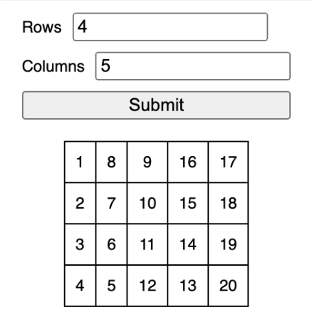

# Generate Table

## Requirements
Generate a table of numbers given the rows and columns.

  1. The user enters the number of rows and columns in a form.
  2. When the form is submitted, a table with the respective number of rows and columns will be generated.
  3. The table contains rows x columns cells, each containing a number sequence from 1 to (rows x columns).

## Implementation
There are two parts to this question: (1) accepting user input and (2) generating the table.

## Accepting User Input
By using <input type="number" min={1}>, we ensure only numbers can be entered and leverage HTML validation so that the minimum value of the fields is 1. That way we don't have to write our own validation.

We can listen for the form submit event, obtain the FormData from it and retrieve the rows and columns value from the form.

## Generating the Table
Generating the table is pretty straightforward. Note that <tr> should be within a <tbody> and not directly within the <table>. The trickier part of table generation is the numbers within each table cell, which involves using a mathematical formula. The number sequence for each column depends on whether the column is an even or odd one, and they be defined using the following formula:

  * Even: rows * col + (row + 1)
  * Odd: rows * (col + 1) - row

## Test Cases
  * Valid values generate table with numbers in the right sequence.
    * Rows: 1, Columns: 1
    * Rows: 4, Columns: 5
  * Invalid values should not generate table.
    * Rows: 1, Columns: Empty
    * Rows: Empty, Columns: 1

## Accessibility
Add <label>s for the <input>s and link them together using < label for="..."> and <input id="...">.