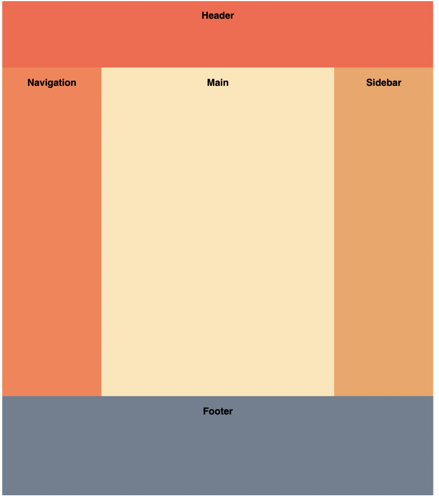

# Holy Grail

## Description
The Holy Grail layout is a famous CSS page layout that has traditionally been hard to implement. It consists of a header, footer, and three columns. The left column contains navigation items, the middle column contains the page contents, and the right column contains ads.

Implement the Holy Grail layout using just CSS. You shouldn't need to change the HTML too much.

## Requirements
  * Header
    * Stretches horizontally across the whole page.
    * Optional: ~60px tall.
  * Columns
    * The center column is fluid-width.
    * All the columns should have the same height, regardless of which column is the tallest.
    * Optional: Both the left and right columns have a fixed width of ~100px.
  * Footer
    * Stretches horizontally across the whole page.
    * The footer should be at the bottom of the page even if there is not enough content to fill up the viewport height.
    * Optional: ~100px tall.

## Implementation
The most widely-supported solution is a Flexbox-based one. It has great browser support and is easiest to understand. A Grid-based approach is also getting popular these days but isn't as well-supported as Flexbox.

There are a few main parts to achieving the specifications using flexbox. Let's dive into each.

## Sticky footer
The Holy Grail layout problem also encompasses another classic problem: making a footer stick to the bottom of the screen when there is not enough content to fill up the page.

This can be solved by adding min-height: 100vh to the container of the page's contents. Since the direct children will be laid out in a vertical fashion, we add display: flex and flex-direction: column to that element as well.

The header and footers are fixed heights and the columns are variable height and is meant to fill up any remaining space. To achieve this, flex-grow: 1 is added to the 
 wrapping the columns.

## Columns
The requirement to make all the columns equal-height is also trivially solved with Flexbox. By adding display: flex to the div wrapper of the columns, this requirement is met.

Like before, the flexible-width <main> content section can be achieved using flex-grow: 1 and it will fill up any horizontal space available.

flex-shrink: 0 has to be added to <nav> and <aside> so that they don't shrink when the content in <main> is too wide.

## Test Cases
  * Test variable width: the navigation and sidebar columns should be fixed width and the middle column is fluid and fills up any remaining space.
  * Test variable height: the header and footer rows should be fixed width and the footer should always be at the bottom of the window.
  * Test lots of content within main. It should not cause the nav and aside to shrink.

## Notes
* There are multiple ways to implement the Holy Grail layout. It'd be good practice to try out a Grid-based approach as well as it might become the de facto solution in future..