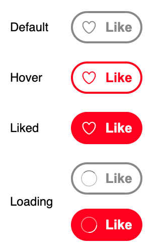

# Like Button

## Description
Create a Like button whose appearance changes based on the following states:

The heart and spinner icons are provided for your convenience. The focus of this question is on the handling of the various states, not so much on being pixel perfect. As for colors, you can use #f00 for the red and #888 for the gray.

## Requirements
  * In the button's default state, when it is clicked, it goes into the loading state and a request is made to the provided back end API which has a 50% chance of succeeding or failing.
  * If the request was successful, the button changes to the "Liked" state.
  * Otherwise it returns to the "Default"/"Hovered" state depending on whether the cursor is still over the button. The error message from the back end API should be shown below the button.
  * If the user clicks on a "Liked"-state button, the reverse flow happens.

## Submission API
  * URL: https://www.greatfrontend.com/api/questions/like-button
  * HTTP Method: POST
  * Content Type: json

## Parameters
The following fields are accepted in the request body:

* action: A string of either 'like' or 'unlike' depending on the desired action.

## Response
The API has a 50% chance of succeeding (HTTP 204) or failing (HTTP 500) so as to make it easy for you to test the request failure cases. It returns a JSON payload of the following shape depending on the outcome.

  * Success: { message: 'Success!' }
  * Failure: { error: 'Unknown error during attempted {{action}}. Please try again later.!' }

## Implementation
The focus of this question is in the handling of the various states when there's a pending request.

## Initialization
To make the likeButton function component-ized, the function takes in two elements, the button element and the error message element. It will be on the developer to ensure that separate instances of DOM elements are passed into the function if there are multiple Like buttons on the page.

## Data Model
We'll need a few state variables:

  * liked: Tracks whether the button is in the default state or the liked state. Since there are only two states, we can use a boolean type to represent it.
  * isPending: Determines if there's a pending background request.
  * errorMessage: Error message obtained from the back end when the API request fails.

## Making Backend API Requests
Writing code to make back end requests is pretty standard, in general you should use the following flow:

  1. Set the UI to show a loading state.
  2. Clear the error message.
  3. Make the back end request via fetch
  4. Determine if the request has succeeded.
    i. If the response has succeeded, update the UI to indicate success.
    ii.. If the response has failed, update the UI to indicate failure by showing an error message.
  5. Remove the loading state.

The above is captured in the likeUnlikeAction function.

## Rendering
Within the button, there are two elements which change often, the icon and the label. Hence we can create two inner spans to contain those elements.

We define two functions for rendering:

  * init: Renders the class names and the elements that don't change. As the name suggests, this function is only being initially and only once.
  * update: Updates the UI to reflect the latest state. This function is being called whenever the UI needs to be updated.

## Test Cases
 *  "Default" state
    * Hovering the button should show the "Hovered" state.
    * Clicking on the button should show a loading spinner.
      * If the request succeeds, the button should transition into the "Liked" state.
      * If the request fails, the button should go back to the "Default" state and an error message is shown below the button.
  * "Liked" state
    * Hovering the button in this state is undefined behavior. It's fine to not show any difference when hovering.
    * Clicking on the button should show a loading spinner.
      * If the request succeeds, the button should transition into the "Default" state.
      * If the request fails, the button should go back to the "Liked" state and an error message is shown below the button.

## Notes
  * Some users might have the habit of double clicking on UI elements. By disabling the button after the first click, we avoid running into the situation where multiple requests are pending at the same time which is probably unintended and can lead to confusing outcome