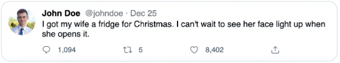
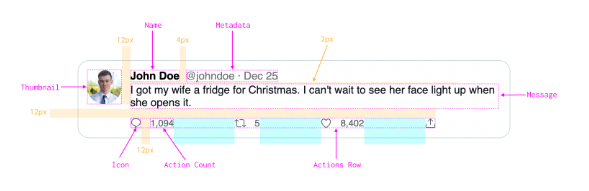

# Tweet

## Description
Write HTML and CSS to build Twitter's tweet UI.

Follow the given specifications as closely as you can. An example thumbnail and icon SVGs are provided to you in the template

## Requirements
  * Tweet
    * Background color: #fff
    * Border color: #cfd9de
    * Border width: 1px
    * Border radius: 16px
    * Padding: 12px
  * Thumbnail
    * Size: 48px
    * Fully rounded
  * Name
    * Color: #000
    * Font family: sans-serif
    * Font size: 15px
    * Font weight: bold
  * Metadata
    * Color: #71767b
    * Font family: sans-serif
    * Font size: 15px
    * Use &middot; for the dot
  * Message
    * Color: #0f1419
    * Font family: sans-serif
    * Font size: 15px
  * Actions Row
    * Max width: 425px
    * Equal spacing between each action
  * Icon
    * Color: #536471
    * Size: 16px
    * Vertically centered with the count
  * Action Count
    * Color: #536471
    * Font size: 13px

## Implementation
This question evaluates a developer's skills on turning a designer's mock into code using HTML and CSS. The CSS involved is not too complex, basic usage of flexbox should be sufficient.

  * Flex is your friend for most modern layout needs. Be familiar with how it works.
  * column-gap and row-gap are very useful here since it won't render the spacing if there are no elements (it's possible that there are no counts for the tweet actions).
  * Equal spacing between tweet actions can be achieved using display: flex; flex: space-between on the container.
  * We can use CSS custom properties/variables to keep the height/width values of the thumbnail and icons in-sync since they are meant to be square. Preprocessors can also do the job, but CSS variables is preferred now since it's a browser native feature.

## Test Cases
  * Variable text length:
    * Tweets with just a few characters.
    * Tweets which don't exceed a single line.
    * Super long author names and handles. This will take some work to handle, so it is ok not to handle this for now.
  * Resize the browser to test rendering on various widths:
    * Narrow width: Renders fine on narrow widths up to 300px.
    * Wide widths: The action row respects the max width and does not stretch across the entire row.
When there are no counts for an action, the spacing between the icon and the count should not be rendered.

## Notes
* Add the aria-hidden="true" attribute for icons so that they are ignored by screen readers.

## Follow Ups
* Handle very long author name and handles by truncating
* Dark mode